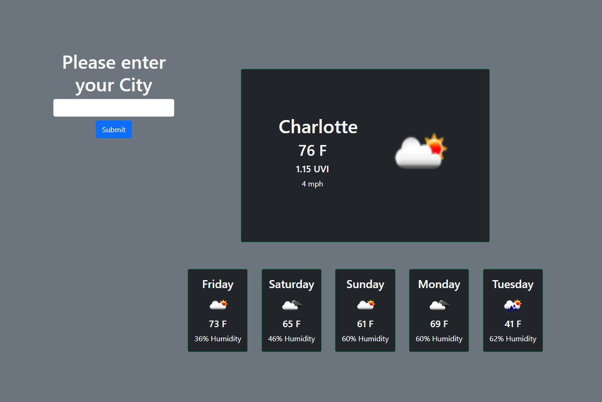

# weather-dashboard

[Deployed Site](https://dcrlsn.github.io/weather-dashboard/)

## Table of Content

- [Usage](#Usage)
- [Description](#Description)

## Usage
Enter your city, the site will then fetch the OpenWeatherMap API for your current weather and 5 day forecast, the border is colored based on the severity of your weather

## Description
The site uses API calls, moment, and bootstrap to give you a simple weather dashboard